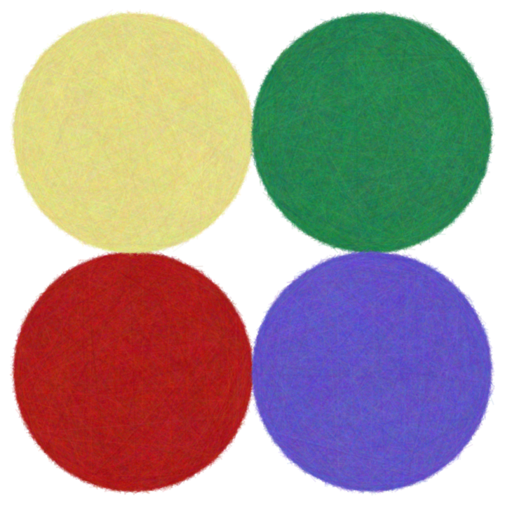
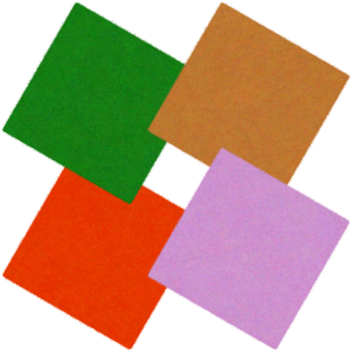
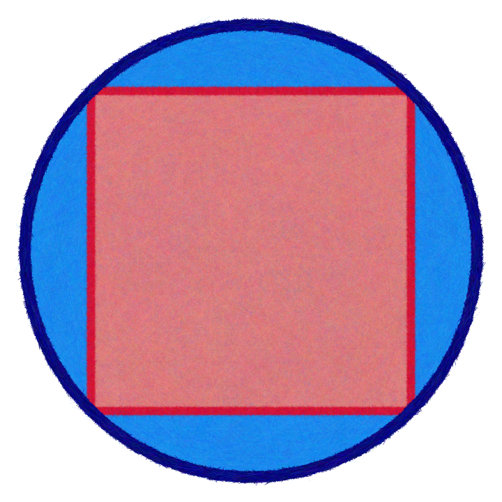
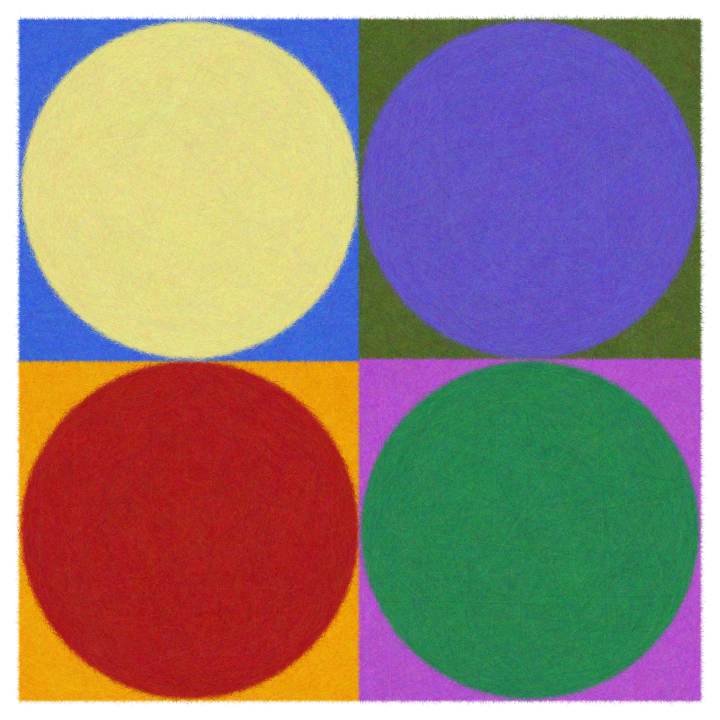
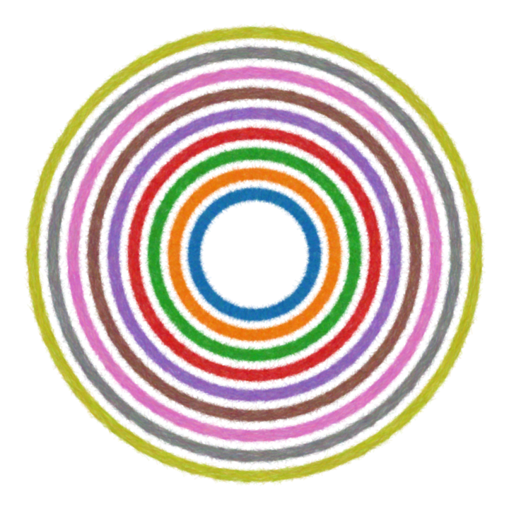
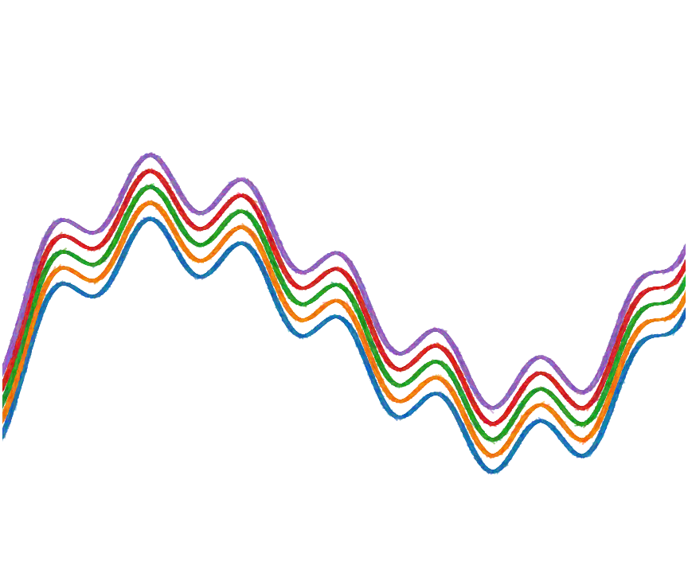
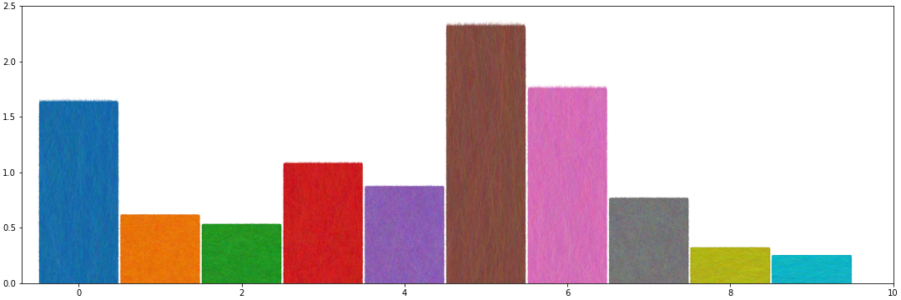
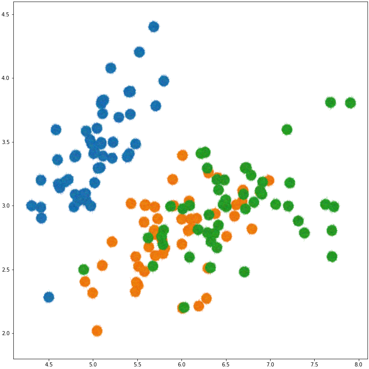

# Compart

[](https://github.com/ColCarroll/compart/actions)

_An experimental library for doing computational art._

Heavily influenced by [Computational Drawing, by Carl Lostritto](http://lostritto.com/book).

## Installation

```python
pip install git+git://github.com/colcarroll/compart.git
```

## Usage

See `/notebooks` for example usage.

Things change fast depending on what I am working on.

The API looks similar to matplotlib APIs, but the abstraction is *very* leaky, in that some calls will require a ton of computation, and some will not require much.

## Example Gallery

These images are generated by the notebooks in `/notebooks`, and are high resolution, where you can see the extra texture.

















